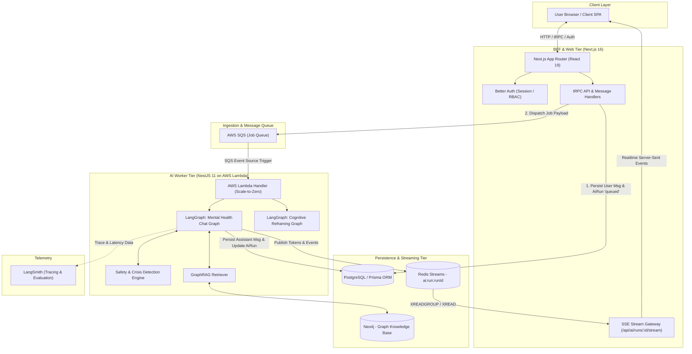
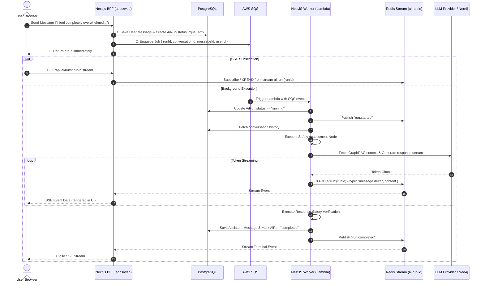
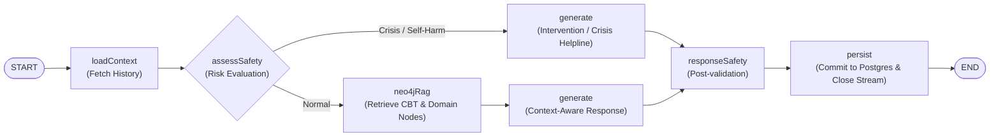

# Rewire System Architecture

> **Architectural Blueprint & System Design Document**  
> *Target Audience: Engineers, System Architects, and Technical Contributors*

---

## 1. Executive Summary & Mission

**Rewire** is an intelligent mental health platform engineered to help individuals navigate overthinking, depression, and acute stress. It pairs evidence-based cognitive restructuring (CBT, mindfulness, Stoic circles of control) with agentic AI workflows, journaling, and longitudinal mood tracking.

From a systems engineering perspective, Rewire is designed around four foundational architectural pillars:
1. **Asynchronous Decoupling**: User-facing web interactions are strictly separated from heavy AI computation via message queues.
2. **Clinical Safety by Design**: Multi-layer risk triage and crisis intervention intercept conversations before and after LLM inference.
3. **Resilient Ephemeral Streaming**: Real-time token delivery via event streams with connection recovery and replayability.
4. **Scale-to-Zero Serverless Execution**: Serverless AI worker lifecycles that eliminate idle infrastructure overhead.

---

## 2. High-Level Architecture Topology



---

## 3. Core Architectural Subsystems

### 3.1. Frontend & Backend-for-Frontend (BFF) — `apps/web`
- **Framework**: Next.js 16 (App Router), React 19, Tailwind CSS v4.
- **Role**: Serves the user interface, terminates user sessions, enforces authentication via **Better Auth**, and acts as the thin API layer.
- **Responsibilities**:
  - Validates user input using shared Zod schemas (`packages/validation`).
  - Persists messages and creates `AiRun` tracking entities with state `queued`.
  - Dispatches lightweight pointer payloads (`{ runId, conversationId, messageId, userId }`) to **AWS SQS**.
  - Serves Server-Sent Events (SSE) directly from **Redis Streams** to stream AI responses without blocking application threads.
- **Strict Boundary**: *The web layer never imports LLM SDKs, never executes LangGraph workflows, and never holds model provider API secrets.*

### 3.2. Asynchronous Decoupling & Queueing — AWS SQS
- **Pattern**: Asynchronous Event-Driven Decoupling.
- **Mechanism**: The user never blocks waiting for an LLM response. The HTTP request returns immediately upon queueing (`runId`), preventing request timeouts and isolating traffic spikes.
- **Message Payload**: Lean, identifier-only payloads to avoid passing unbounded payloads across network boundaries:
  ```json
  {
    "runId": "cuid_...",
    "conversationId": "cuid_...",
    "messageId": "cuid_...",
    "userId": "cuid_..."
  }
  ```

### 3.3. AI Worker Tier — `apps/api`
- **Framework**: NestJS 11 packaged for **AWS Lambda**.
- **Execution Lifecycle**: Scale-to-zero serverless worker. Lambda boots on SQS event receipt, executes the workflow, flushes events, updates the database, and shuts down when idle.
- **Responsibilities**:
  - Pulls authoritative conversation history from PostgreSQL.
  - Compiles and drives **LangGraph** state machines.
  - Performs multi-phase safety triage.
  - Queries **Neo4j** for GraphRAG therapeutic context.
  - Publishes token deltas into **Redis Streams**.
  - Writes the final assistant response and marks `AiRun` as `completed` (or `failed`).

### 3.4. State, Caching & Graph Tier
- **PostgreSQL (`packages/database`)**: Authoritative system of record. Stores users, accounts, sessions, conversations, messages, AI run states, and journal entries.
- **Redis Streams**: Ephemeral, high-throughput event logs partitioned by run (`ai:run:{runId}`). Decouples the producer (Lambda worker) from the consumer (Next.js SSE route). Retains tokens for recovery/replay.
- **Neo4j**: Graph database powering GraphRAG. Models clinical concepts, cognitive distortions (e.g., Catastrophizing, Black-and-White Thinking), coping mechanisms, and user journey relationships.
- **LangSmith**: Distributed tracing for LLM calls, tracking latency, token usage, and trajectory evaluation.

---

## 4. End-to-End Execution Flows

### 4.1. Conversational Chat & Streaming Flow



### 4.2. LangGraph AI Workflow Architecture

The core agent workflows are modeled as deterministic, stateful directed graphs:



- **Early Crisis Routing**: If acute danger or self-harm triggers are detected during `assessSafety`, the graph bypasses normal RAG retrieval and branches directly into crisis de-escalation with vetted helpline resources.
- **Response Validation**: `responseSafety` inspects generated output to ensure no medical diagnoses or harmful advice are transmitted.

---

## 5. Key Architectural Decisions (ADRs)

| Decision | Chosen Approach | Rationale | Alternatives Considered |
| :--- | :--- | :--- | :--- |
| **Monorepo Strategy** | Turborepo + pnpm | Shared type-safety across boundaries; unified build pipelines; isolated dependency graphs. | Polyrepo (version drift, slow dev loop). |
| **Worker Decoupling** | SQS + AWS Lambda | Scale-to-zero economics; protects Next.js web server from unbounded LLM execution durations; handles burst traffic gracefully. | Running LangGraph directly inside Next.js API routes (leads to Vercel/Node timeouts). |
| **Streaming Mechanism** | Redis Streams + SSE | Replayable event logs allow graceful connection recovery if client drops network; ephemeral SSE lifetime bound only to active generation. | WebSockets (heavy connection overhead on serverless), Redis Pub/Sub (messages lost if client disconnects). |
| **AI Orchestration** | LangGraph (StateGraph) | Explicit conditional branching for safety-critical pathways; deterministic node execution order; granular observability. | Unstructured single-prompt chains or autonomous multi-agent loops. |
| **Domain Knowledge** | Neo4j (GraphRAG) | Models relationships between cognitive distortions, therapeutic strategies, and user patterns far better than flat vector-only search. | Pure vector database (lacks relational context between psychological concepts). |

---

## 6. Security, Privacy & Safety Governance

1. **Defense-in-Depth AI Safety**:
   - Safety checks run as dedicated pipeline stages, not just system prompt suggestions.
   - Guardrails prevent diagnosis claims, providing clear clinical disclaimers.
2. **Credential Isolation**:
   - Zero LLM keys or database connection strings are exposed to the client.
   - Better Auth handles HTTP-only secure cookie sessions with CSRF protection.
3. **Data Protection**:
   - User conversations are scoped strictly by authenticated `userId` across both PostgreSQL queries and Redis streaming channels.
   - Stream channels are ephemeral and auto-expire to prevent memory bloat.

---

## 7. Monorepo Organization & Code Boundaries

```
rewire/
├── apps/
│   ├── api/                 # NestJS 11 AI Worker (Lambda execution, LangGraph, SQS Consumer)
│   │   └── src/modules/
│   │       ├── agent/       # LangGraph graphs, nodes, prompts, safety, & GraphRAG
│   │       ├── queue/       # SQS Consumer Service
│   │       ├── redis/       # Redis Streams producer
│   │       ├── neo4j/       # Neo4j GraphRAG connection driver
│   │       └── conversations/ # Database persistence adapter
│   └── web/                 # Next.js 16 App Router (BFF, UI, SSE Gateway, SQS Producer)
│       ├── app/api/ai/      # SSE streaming routes (/api/ai/runs/:id/stream)
│       ├── trpc/            # Type-safe API routers for conversation & mood tracking
│       └── lib/             # Better Auth, SQS client, Redis client
│
└── packages/
    ├── database/            # Prisma schema, migrations, and PostgreSQL client
    ├── types/               # Shared cross-boundary TypeScript types (AiJobPayload, etc.)
    ├── validation/          # Shared Zod schemas (request bodies, form validations)
    └── config/              # Shared ESLint, TypeScript, and Tailwind configurations
```
