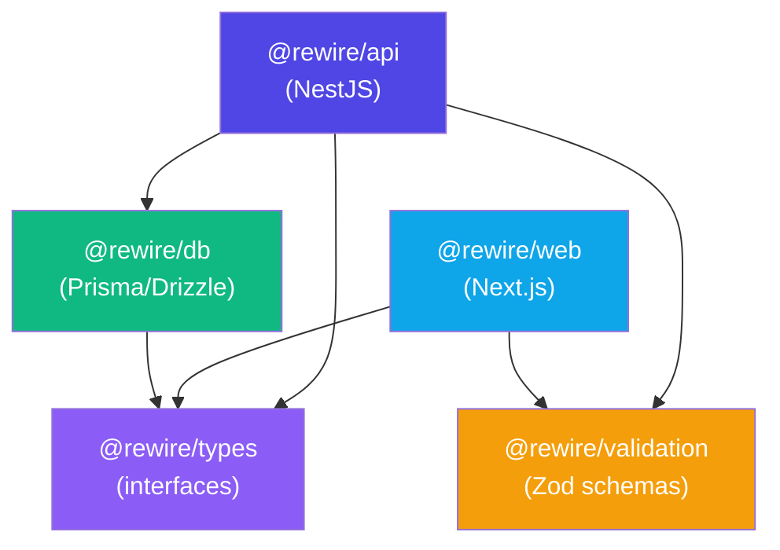

# Rewire Monorepo — Structure & Best Practices Guide

## Your Current Structure

```
rewire/
├── apps/
│   ├── api/          → @rewire/api     (NestJS backend)
│   └── web/          → @rewire/web     (Next.js frontend)
├── packages/
│   ├── types/        → @rewire/types   (shared TypeScript interfaces)
│   ├── validation/   → @rewire/validation (Zod schemas)
│   └── config/       → (empty, unused)
├── pnpm-workspace.yaml
├── turbo.json
└── package.json
```

---

## The Two Directories: `apps/` vs `packages/`

| Directory | Purpose | Examples |
|---|---|---|
| `apps/` | **Deployable applications** — things that run | API server, web frontend, mobile app, admin panel |
| `packages/` | **Shared libraries** — things that are imported | Types, validation, UI components, database client, utils |

> [!TIP]
> **Rule of thumb**: If two or more apps need the same code, it belongs in `packages/`.

---

## Recommended Structure for Rewire

Here's what a well-structured chat app monorepo looks like:

```
rewire/
├── apps/
│   ├── api/                    # NestJS backend
│   └── web/                    # Next.js frontend
│
├── packages/
│   ├── types/                  # Shared TypeScript types/interfaces
│   │   └── src/
│   │       ├── index.ts        # Barrel export
│   │       ├── user.ts
│   │       ├── conversation.ts
│   │       └── message.ts
│   │
│   ├── validation/             # Shared Zod schemas
│   │   └── src/
│   │       ├── index.ts        # Barrel export
│   │       ├── sendMessageSchema.ts
│   │       └── userSchema.ts
│   │
│   ├── db/                     # Database layer (Prisma/Drizzle)
│   │   ├── src/
│   │   │   ├── index.ts
│   │   │   └── client.ts
│   │   ├── prisma/
│   │   │   └── schema.prisma
│   │   └── package.json
│   │
│   ├── config/                 # Shared config (ESLint, TS, etc.)
│   │   ├── eslint/
│   │   │   └── base.js
│   │   ├── typescript/
│   │   │   └── base.json
│   │   └── package.json
│   │
│   └── ui/                     # Shared React components (optional)
│       └── src/
│           ├── index.ts
│           ├── Button.tsx
│           └── Avatar.tsx
│
├── pnpm-workspace.yaml
├── turbo.json
├── package.json
├── .gitignore
└── tsconfig.json               # Root TS config (optional)
```

---

## Best Practices

### 1. Package Naming Convention

Always use a consistent scope prefix:

```json
// ✅ Good — consistent @rewire/ scope
{ "name": "@rewire/types" }
{ "name": "@rewire/api" }
{ "name": "@rewire/db" }

// ❌ Bad — inconsistent naming
{ "name": "types" }
{ "name": "rewire-api" }
```

### 2. Package.json for Shared Packages

Every shared package should follow this pattern:

```json
{
  "name": "@rewire/package-name",
  "version": "0.0.0",
  "private": true,
  "exports": {
    ".": "./src/index.ts"
  }
}
```

> [!IMPORTANT]
> Use `"exports"` (not `"main"`) for TypeScript source packages. This tells consuming apps to import directly from `.ts` files — no build step needed for internal packages.

### 3. Barrel Exports (`index.ts`)

Every package needs a `src/index.ts` that re-exports everything:

```typescript
// packages/types/src/index.ts
export * from "./user";
export * from "./conversation";
export * from "./message";
```

This lets consumers do:
```typescript
import { User, Conversation } from "@rewire/types";
```

### 4. Internal Dependencies

Use `workspace:*` to reference sibling packages:

```json
{
  "dependencies": {
    "@rewire/types": "workspace:*",
    "@rewire/validation": "workspace:*"
  }
}
```

### 5. Turbo Pipeline (`turbo.json`)

Your current config is good. Key concepts:

```jsonc
{
  "tasks": {
    "build": {
      "dependsOn": ["^build"],   // Build dependencies FIRST
      "outputs": ["dist/**", ".next/**"]
    },
    "dev": {
      "cache": false,            // Never cache dev servers
      "persistent": true         // Keep running
    },
    "lint": {},
    "typecheck": {
      "dependsOn": ["^build"]   // Typecheck after deps are built
    }
  }
}
```

> [!NOTE]
> `^build` means "build my dependencies before building me". This ensures `@rewire/types` is built before `@rewire/api` which depends on it.

### 6. Shared TypeScript Config

Create a base `tsconfig.json` that all packages extend:

```jsonc
// packages/config/typescript/base.json
{
  "compilerOptions": {
    "strict": true,
    "esModuleInterop": true,
    "skipLibCheck": true,
    "forceConsistentCasingInFileNames": true,
    "resolveJsonModule": true,
    "isolatedModules": true,
    "moduleDetection": "force"
  }
}
```

Then in each app:
```jsonc
// apps/api/tsconfig.json
{
  "extends": "@rewire/config/typescript/base.json",
  "compilerOptions": { ... }
}
```

---

## Dependency Graph

This is how your packages should relate to each other:



> [!IMPORTANT]
> **Packages should NEVER import from apps.** Dependencies only flow downward: `apps → packages`.

---

## Common Mistakes to Avoid

| Mistake | Why it's bad |
|---|---|
| Nested `pnpm-lock.yaml` in apps | Creates conflicting dependency trees |
| Nested `pnpm-workspace.yaml` in apps | Creates a workspace-within-a-workspace |
| App-specific `node_modules/` with own lockfile | Dependencies should be managed from root |
| Using `"main"` instead of `"exports"` | `exports` is the modern standard, supports conditional exports |
| Duplicating types across apps | Extract to `@rewire/types` instead |
| Duplicating validation logic | Extract to `@rewire/validation` instead |
| No barrel exports (`index.ts`) | Forces consumers to import from deep paths |

---

## Next Steps for Rewire

1. **Delete `packages/config/`** (it's empty) or set it up with shared ESLint/TS configs
2. **Add `@rewire/db`** — your database package with Prisma or Drizzle
3. **Build your API endpoints** — conversations, messages, auth
4. **Build your chat UI** — using shared types from `@rewire/types`

When you're ready to start building features, just tell me what you want to work on first!
