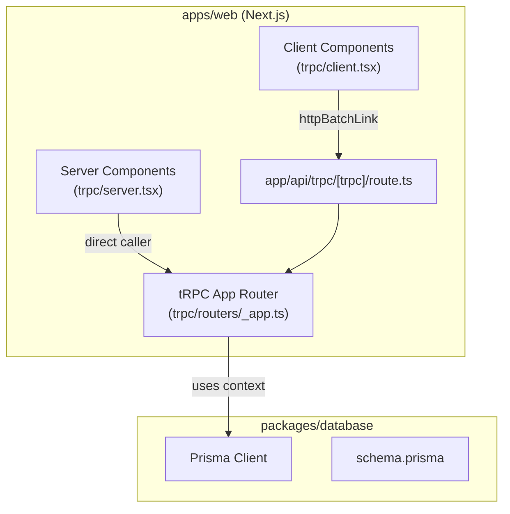

# Set up tRPC v11 + Prisma in the Rewire Monorepo

Set up end-to-end type-safe APIs using tRPC v11 with the Next.js App Router pattern, backed by Prisma for database access. Following the [official tRPC App Router setup guide](https://trpc.io/docs/client/nextjs/app-router-setup).

## Architecture Overview



---

## Proposed Changes

### 1. Shared Database Package — `packages/database`

New package to house Prisma schema + generated client, importable from any app.

#### [NEW] [package.json](file:///Volumes/CobletSSD/ProjectsSourceCode/rewire/packages/database/package.json)
- Package `@rewire/database`
- Dependencies: `prisma` (dev), `@prisma/client`
- Exports `./src/index.ts` for barrel, `./src/client` for raw Prisma client

#### [NEW] [prisma/schema.prisma](file:///Volumes/CobletSSD/ProjectsSourceCode/rewire/packages/database/prisma/schema.prisma)
- SQLite datasource for local dev (easy start, no Docker needed)
- Models matching existing types: `User`, `Conversation`, `ConversationMessage`

#### [NEW] [src/client.ts](file:///Volumes/CobletSSD/ProjectsSourceCode/rewire/packages/database/src/client.ts)
- Singleton Prisma client pattern (prevents hot-reload connection exhaustion)

#### [NEW] [src/index.ts](file:///Volumes/CobletSSD/ProjectsSourceCode/rewire/packages/database/src/index.ts)
- Re-exports Prisma client + generated types

---

### 2. tRPC Server Init — `apps/web/trpc/`

Following the exact tRPC v11 docs file structure.

#### [NEW] [init.ts](file:///Volumes/CobletSSD/ProjectsSourceCode/rewire/apps/web/trpc/init.ts)
- `initTRPC` with context containing `headers` + `db` (Prisma client)
- Exports `createTRPCContext`, `createTRPCRouter`, `createCallerFactory`, `baseProcedure`

#### [NEW] [routers/_app.ts](file:///Volumes/CobletSSD/ProjectsSourceCode/rewire/apps/web/trpc/routers/_app.ts)
- Root `appRouter` merging sub-routers
- Exports `AppRouter` type

#### [NEW] [routers/user.ts](file:///Volumes/CobletSSD/ProjectsSourceCode/rewire/apps/web/trpc/routers/user.ts)
- Example sub-router: `user.list`, `user.byId`
- Demonstrates Prisma queries through context

#### [NEW] [routers/conversation.ts](file:///Volumes/CobletSSD/ProjectsSourceCode/rewire/apps/web/trpc/routers/conversation.ts)
- Example sub-router: `conversation.list`, `conversation.byId`, `conversation.sendMessage`
- Uses `@rewire/validation` schemas for input validation

---

### 3. tRPC Client Plumbing — `apps/web/trpc/`

#### [NEW] [query-client.ts](file:///Volumes/CobletSSD/ProjectsSourceCode/rewire/apps/web/trpc/query-client.ts)
- Shared `makeQueryClient()` factory
- Configures `staleTime: 30s`, `shouldDehydrateQuery` for pending queries (enables RSC streaming)

#### [NEW] [client.tsx](file:///Volumes/CobletSSD/ProjectsSourceCode/rewire/apps/web/trpc/client.tsx)
- `'use client'` — creates `TRPCProvider`, `useTRPC` via `createTRPCContext<AppRouter>()`
- `TRPCReactProvider` component wrapping `QueryClientProvider` + `TRPCProvider`
- `getUrl()` helper for API endpoint resolution

#### [NEW] [server.tsx](file:///Volumes/CobletSSD/ProjectsSourceCode/rewire/apps/web/trpc/server.tsx)
- Server-side tRPC caller for RSC (React Server Components)
- Uses `createCallerFactory` + `createTRPCContext` with `next/headers`
- Wraps in `HydrateClient` for dehydrated state transfer

---

### 4. Next.js API Route Handler

#### [NEW] [app/api/trpc/[trpc]/route.ts](file:///Volumes/CobletSSD/ProjectsSourceCode/rewire/apps/web/app/api/trpc/%5Btrpc%5D/route.ts)
- `fetchRequestHandler` from `@trpc/server/adapters/fetch`
- Mounts `appRouter` as GET and POST handlers
- Passes request headers into `createTRPCContext`

---

### 5. Layout Integration

#### [MODIFY] [layout.tsx](file:///Volumes/CobletSSD/ProjectsSourceCode/rewire/apps/web/app/layout.tsx)
- Wrap `{children}` with `TRPCReactProvider` from `@/trpc/client`

---

### 6. Config Updates

#### [MODIFY] [next.config.ts](file:///Volumes/CobletSSD/ProjectsSourceCode/rewire/apps/web/next.config.ts)
- Add `@rewire/database` to `transpilePackages`

#### [MODIFY] [package.json (web)](file:///Volumes/CobletSSD/ProjectsSourceCode/rewire/apps/web/package.json)
- Add dependencies: `@trpc/server`, `@trpc/client`, `@trpc/tanstack-react-query`, `@tanstack/react-query`, `@rewire/database`, `client-only`, `server-only`, `superjson`

---

## Open Questions

> [!IMPORTANT]
> **Database choice**: I'll use **SQLite** for the Prisma datasource since it requires zero infrastructure for local dev. You can switch to PostgreSQL/MySQL later by changing the datasource in `schema.prisma` and the connection string. Is SQLite OK for now?

> [!NOTE]
> **Zod version**: Your `@rewire/validation` uses `zod@^4.4.3` (Zod 4). tRPC v11 supports Zod 4 — I'll use the same version across the project so schemas are compatible.

---

## Verification Plan

### Automated Tests
```bash
# 1. Install deps & generate Prisma client
cd packages/database && pnpm install && pnpx prisma generate && pnpx prisma db push

# 2. Install tRPC deps in web app
cd apps/web && pnpm install

# 3. Type-check the entire monorepo
pnpm turbo typecheck

# 4. Start dev server & verify tRPC endpoint
cd apps/web && pnpm dev
# Test: curl http://localhost:3000/api/trpc/user.list
```

### Manual Verification
- Dev server starts without errors
- tRPC API route responds at `/api/trpc/[trpc]`
- TypeScript gives full end-to-end type inference on the client
