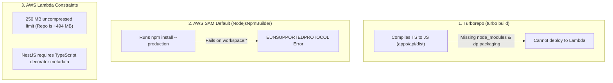
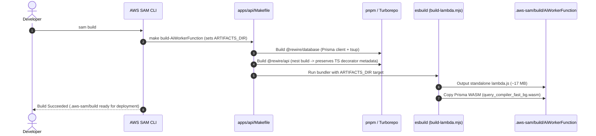

# AWS SAM Monorepo Build Architecture Guide

This document details the architectural decisions, root-cause analysis, and build pipeline required to deploy the **NestJS AI Worker** from a **pnpm + Turborepo monorepo** to **AWS Lambda** using **AWS SAM**.

---

## 1. The Core Problem: Why Standard Builds Fail

When deploying a serverless microservice inside a TypeScript monorepo, three distinct systems interact: **Turborepo**, **AWS SAM CLI**, and **AWS Lambda's execution environment**.



### A. `turbo build` vs. `sam build`
* **Turborepo (`turbo build`)** is an internal monorepo task orchestrator. It executes `"nest build"` inside `apps/api`, compiling TypeScript to CommonJS in `apps/api/dist/`.
* **Turborepo does NOT package applications for AWS Lambda.** Lambda runs in an isolated Linux microVM. Uploading only `dist/` results in immediate `Cannot find module '@nestjs/core'` crashes because Lambda does not have access to your machine's or monorepo's `node_modules`.

### B. Why SAM's Default Builder Failed
When running `sam build`, SAM's responsibility is to assemble the **exact standalone directory** (code + all production dependencies) that gets zipped and uploaded to AWS Lambda (`.aws-sam/build/AiWorkerFunction`).
* By default, SAM invokes `NodejsNpmBuilder`.
* `NodejsNpmBuilder` copies `package.json` to an isolated scratch folder and runs:
  ```bash
  npm install --production
  ```
* Because this monorepo uses **pnpm workspaces**, `apps/api/package.json` contains:
  ```json
  "@rewire/database": "workspace:*",
  "@rewire/types": "workspace:*"
  ```
* Standard `npm` does not recognize the `workspace:` protocol and terminates with:
  ```text
  npm error code EUNSUPPORTEDPROTOCOL
  npm error Unsupported URL Type "workspace:": workspace:*
  ```
* Furthermore, in that isolated build sandbox, sibling packages (`packages/database`, `packages/types`) are completely absent.

---

## 2. Why Built-In Alternatives Do Not Work

### Alternative 1: SAM's Native `BuildMethod: esbuild`
AWS SAM has a built-in `BuildMethod: esbuild` configuration. However, running it directly on NestJS source files breaks runtime dependency injection:

> [!WARNING]
> **The NestJS Dependency Injection Trap**:
> NestJS relies heavily on TypeScript's `emitDecoratorMetadata: true` to inject services into constructors:
> ```typescript
> @Injectable()
> export class SqsConsumerService {
>   constructor(
>     private readonly configService: ConfigService,
>     private readonly agentService: AgentService
>   ) {}
> }
> ```
> The TypeScript compiler (`tsc`) emits design metadata:
> ```javascript
> __metadata("design:paramtypes", [ConfigService, AgentService])
> ```
> If `esbuild` compiles TypeScript source files directly, it strips type annotations and drops `design:paramtypes`. The build passes, but the moment Lambda boots up and receives an event, it crashes at runtime with:
> ```text
> Nest can't resolve dependencies of SqsConsumerService (?). 
> Please make sure that the argument ConfigService at index [0] is available.
> ```

### Alternative 2: Naively Copying `node_modules`
* The unbundled production `node_modules` for this service exceeds **494 MB**.
* AWS Lambda has a strict hard limit: **maximum 250 MB uncompressed package size**.
* `pnpm` also uses symlinks referencing the global `.pnpm-store`, which break when deployed to AWS Lambda.

---

## 3. The Official Solution: `BuildMethod: makefile`

According to [AWS SAM Official Documentation on Custom Build Workflows](https://docs.aws.amazon.com/serverless-application-model/latest/developerguide/building-custom-workflows.html), **`BuildMethod: makefile`** is AWS SAM's official, recommended mechanism whenever using monorepos, pnpm, Yarn Berry, or custom compilation pipelines.

### End-to-End Workflow



---

## 4. Implementation Details

### Step 1: SAM Template Configuration
In `apps/api/template.yaml`, configure `Metadata: BuildMethod: makefile` under `AiWorkerFunction`:

```yaml
  AiWorkerFunction:
    Type: AWS::Serverless::Function
    Properties:
      FunctionName: !Sub "rewire-ai-worker-${Environment}"
      CodeUri: .
      Handler: dist/lambda.handler
      Runtime: nodejs22.x
      Architectures:
        - arm64
    Metadata:
      BuildMethod: makefile
```

### Step 2: Monorepo-Aware Makefile
In `apps/api/Makefile`, SAM supplies the destination directory via `$(ARTIFACTS_DIR)`. The Makefile resolves the monorepo root so all dependencies compile in their native workspace environment:

```makefile
.PHONY: build-AiWorkerFunction

build-AiWorkerFunction:
	@echo "Resolving monorepo root from $(ARTIFACTS_DIR)..."
	$(eval REPO_ROOT := $(shell cd "$(ARTIFACTS_DIR)/../../../../.." && pwd))
	@echo "Monorepo root: $(REPO_ROOT)"
	# 1. Build workspace database package
	pnpm --dir "$(REPO_ROOT)" --filter @rewire/database build
	# 2. Build NestJS API (preserves decorator metadata)
	pnpm --dir "$(REPO_ROOT)" --filter @rewire/api build
	# 3. Package Lambda bundle into SAM ARTIFACTS_DIR
	ARTIFACTS_DIR="$(ARTIFACTS_DIR)" node "$(REPO_ROOT)/apps/api/scripts/build-lambda.mjs"
```

### Step 3: Two-Phase Compilation & Bundling
In `apps/api/scripts/build-lambda.mjs`:
1. **Phase 1 (TypeScript & Metadata)**: `nest build` runs via `tsc`, emitting JavaScript containing valid `__metadata("design:paramtypes", ...)` calls.
2. **Phase 2 (Standalone Bundling)**: `esbuild` bundles the *already-compiled JavaScript* (`dist/lambda.js`), inlining workspace packages (`@rewire/database`, `@rewire/types`) into a single file.
3. **Prisma WASM Runtime**: Copies Prisma 7's WebAssembly query compiler (`query_compiler_fast_bg.wasm`) alongside the bundle.

---

## 5. Summary Comparison Table

| Metric / Aspect | Default SAM (`npm install`) | Raw `esbuild` on Source | Custom Makefile Workflow |
| :--- | :--- | :--- | :--- |
| **pnpm Monorepo Support** | ❌ Fails (`workspace:*`) | ⚠️ Path aliases struggle | **Full workspace support** |
| **NestJS Dependency Injection**|  Works | ❌ Crashes at runtime | **Works (Preserves metadata)** |
| **Deployment Package Size** | ~494 MB (Exceeds limit) | ~17 MB | **~17 MB (Compliant)** |
| **Prisma Engine / WASM** | Missing binaries | Missing binaries | **Bundled & copied** |
| **Cold Start Speed** | Slow (> 5s) | Fast (~300ms) | **Fast (~300ms)** |

---

## 6. Root Workspace Commands

Run these directly from the monorepo root:

```bash
# Build the Lambda deployment package
pnpm sam:build

# Validate SAM template syntax and policies
pnpm sam:validate

# Deploy using default profile (guided / staging)
pnpm sam:deploy

# Deploy directly to production stack
pnpm sam:deploy:prod

# Invoke Lambda locally with Docker
pnpm sam:local

# Stream live CloudWatch logs from AWS
pnpm sam:logs
```

---

## 7. Architecture FAQ: Why Not Use Docker-Based SAM Build or Deploy?

### The Question
> *"Why not use Docker-based SAM build (`sam build --use-container`) or a Container Image Lambda (`PackageType: Image`)? When creating a new SAM project via `sam init`, SAM often prompts for a Docker/Image build. Why did we choose Zip + local bundling instead?"*

In AWS SAM and AWS Lambda, there are two distinct ways Docker is used:
1. **Container Image Lambda (`PackageType: Image`)**: The function is packaged as a Docker container image with a `Dockerfile` and pushed to Amazon ECR (Elastic Container Registry).
2. **Docker-Based Local Build (`sam build --use-container`)**: The function is packaged as a `.zip`, but SAM spins up an official AWS Docker container on your machine to execute `npm install` inside Linux.

Here is why **Zip-based deployment with local `esbuild` bundling** was chosen over Docker for this application:

---

### Reason 1: Build Speed (~1 Second vs. 30–90 Seconds)

```text
Local esbuild pipeline: [==] ~1.2s  (Instant developer feedback)
Docker-based build:     [================================================] ~45s - 90s
```

* **With Docker**: Every build invocation must spin up a ~1GB Docker image (`public.ecr.aws/sam/build-nodejs22.x`), mount filesystem volumes, initialize container daemons, and run.
* **With Local Bundling**: TypeScript compilation + Prisma WASM resolution + standalone bundling finishes in **~1.2 seconds**. Fast local testing (`pnpm sam:build`) and rapid CI/CD runs.

---

### Reason 2: Cold Start Latency (Critical for AI Scale-to-Zero UX)

Your application architecture enforces that the NestJS AI Worker **scales to zero**:
```text
No messages in SQS  ──>  0 Lambda workers active ($0 idle cost)
New SQS message     ──>  Worker cold-starts  ──>  Streams tokens via Redis
```

* **Zip Lambda (~17 MB bundle)**: AWS's Firecracker microVM unzips and boots the 17 MB standalone file in **~200–300 ms**.
* **Docker Container Lambda**: Pulling container image layers from Amazon ECR and booting the Linux container environment frequently adds **2 to 5+ seconds** to cold starts.
* In mental health chat and cognitive reframing, an extra 3–5 second delay on cold starts noticeably degrades user experience.

---

### Reason 3: The Monorepo Boundary Problem in Docker

Docker builds are strictly isolated to their build context.
* If a `Dockerfile` is placed in `apps/api/`, it **cannot access** sibling packages like `packages/database` or `packages/types` by default (Docker security blocks `COPY ../../packages`).
* To make Docker work in a monorepo, you must:
  1. Set the Docker context to the entire monorepo root.
  2. Write complex multi-stage Dockerfiles copying `pnpm-workspace.yaml`, root `package.json`, and all shared packages.
  3. Re-install pnpm and re-download dependencies inside the container on every build.
* With `sam build --use-container`, SAM mounts only `CodeUri` (`apps/api`), so the container still would not have access to `packages/database` and would fail on `workspace:*`.

---

### Reason 4: Zero ECR Infrastructure & Maintenance Overhead

| Aspect | Zip-Based Deployment (Current) | Docker Image Lambda (ECR) |
| :--- | :--- | :--- |
| **AWS Storage** | S3 (provisioned & managed automatically by SAM) | Amazon ECR (Elastic Container Registry) |
| **Local Requirement** | Node.js & pnpm only | Docker Desktop / OrbStack daemon must always be running |
| **Maintenance** | None | Must configure ECR repo, tag policies, and image cleanup |
| **CI/CD Complexity** | Single command (`pnpm sam:deploy`) | Must authenticate Docker to ECR (`aws ecr get-login-password`) |

---

### Reason 5: Pure JavaScript & WebAssembly (No Native C++ Binaries)

The primary technical reason AWS recommends `sam build --use-container` for Node.js is when projects use **native C++ bindings** (compiled via `node-gyp` against Linux x86_64/arm64) that cannot be compiled directly on macOS.

In this project:
* NestJS, LangChain, LangGraph, Neo4j driver, AWS SDK v3, and Redis are **pure JavaScript**.
* Prisma 7 uses **WebAssembly (`query_compiler_fast_bg.wasm`)** and `@prisma/adapter-pg` (pure JS Postgres driver).
* Because JavaScript and WebAssembly are completely platform-independent, the bundle generated on macOS runs identically on AWS Lambda Linux without requiring a Linux container build.

---

### Decision Matrix: When to Use Docker vs. Zip Bundling

| Use Case / Requirement | Recommended Approach |
| :--- | :--- |
| Application artifact exceeds **250 MB** (e.g. PyTorch, heavy ML weights, FFmpeg, Chromium) | **Docker Image Lambda (`PackageType: Image`)** |
| Requires custom OS-level system libraries (`apt-get install ...`) | **Docker Image Lambda (`PackageType: Image`)** |
| Native C/C++ libraries that must compile against Amazon Linux | **`sam build --use-container`** |
| Microservices requiring **sub-second cold starts** and fast CI/CD builds | **Zip + Bundling (Our Setup)** |
| Clean TypeScript monorepos using shared workspace packages | **Zip + Bundling (Our Setup)** |


