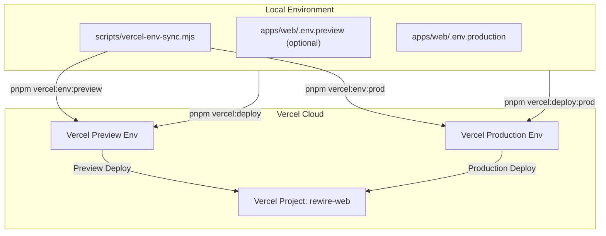

# Vercel Pre-Prod and Prod Deployment Setup with Production Env Variables

## Background & Goal
You have installed the Vercel CLI (`vercel`) and want an easy, automated way to:
1. Deploy **Pre-prod (Preview)** and **Production** versions of `@rewire/web` directly from the CLI.
2. Easily manage, sync, and deploy with your **production and pre-prod environment variables** without manually entering each secret into the Vercel dashboard.
3. Ensure the Turborepo monorepo setup (`@rewire/web` depending on `@rewire/database`, `@rewire/types`, and `@rewire/validation`) builds cleanly on Vercel.

---

## User Review Required

> [!IMPORTANT]
> **Project Name on Vercel**:
> By default, we will configure the project name as **`rewire-web`** (under your account `aadarshbabus-projects`).
>
> **Environment Variables**:
> `apps/web/.env.production` already contains keys for:
> - `BETTER_AUTH_SECRET`
> - `BETTER_AUTH_URL`
> - `NEXT_PUBLIC_APP_URL`
> - `DATABASE_URL` (Aiven PostgreSQL)
> - `REDIS_URL` (Aiven Valkey/Redis)
> - `AWS_SQS_QUEUE_URL`
> - `AWS_REGION`
>
> We will provide an automated script to bulk sync these into Vercel for `production` and/or `preview` in one command.

---

## Proposed Architecture & Workflow

---

## Proposed Changes

### 1. Root & Git Configuration
#### [MODIFY] [.gitignore](file:///Volumes/CobletSSD/ProjectsSourceCode/rewire/.gitignore)
- Ensure `.vercel` is ignored in root `.gitignore` so local deployment metadata isn't committed.

### 2. Vercel Configuration for Turborepo
#### [NEW] [vercel.json](file:///Volumes/CobletSSD/ProjectsSourceCode/rewire/vercel.json)
- Create `vercel.json` at the monorepo root:
  - Specify framework: `nextjs`
  - Build command: `pnpm --filter @rewire/web... build`
  - Output directory: `apps/web/.next`
  - This ensures remote Vercel builds generate Prisma client and build workspace dependencies before compiling the Next.js frontend.

### 3. Environment Variable Sync Helper
#### [NEW] [scripts/vercel-env-sync.mjs](file:///Volumes/CobletSSD/ProjectsSourceCode/rewire/scripts/vercel-env-sync.mjs)
- A cross-platform Node.js script that:
  - Takes a target environment (`production` | `preview` | `development`) and an env file path (defaults to `apps/web/.env.production` or `apps/web/.env.preview`).
  - Parses key-value pairs safely (stripping comments, preserving quotes).
  - Uses the official Vercel CLI (`vercel env add <KEY> <ENV> --value <VALUE> --force --yes`) non-interactively to batch sync all variables into your Vercel project in seconds.

### 4. NPM / PNPM Package Scripts
#### [MODIFY] [package.json](file:///Volumes/CobletSSD/ProjectsSourceCode/rewire/package.json)
Add standardized convenience scripts matching the existing `sam:*` pattern:
- `pnpm vercel:link`: Run `vercel link` to link the repository to `rewire-web`.
- `pnpm vercel:deploy`: Deploy pre-prod (preview) build (`vercel`).
- `pnpm vercel:deploy:prod`: Deploy to production (`vercel --prod`).
- `pnpm vercel:env:push:prod`: Sync `apps/web/.env.production` to Vercel Production.
- `pnpm vercel:env:push:preview`: Sync `apps/web/.env.production` (or `.env.preview`) to Vercel Preview.
- `pnpm vercel:env:pull:prod`: Pull production env vars from Vercel to `.env.production.local`.
- `pnpm vercel:env:pull:preview`: Pull preview env vars from Vercel to `.env.preview.local`.

---

## Verification Plan

### Automated / CLI Verification
1. Verify `node scripts/vercel-env-sync.mjs --dry-run` to ensure correct parsing of environment variables without leaking credentials.
2. Link the project with `vercel link --project rewire-web` (or guide user interactively).
3. Test `vercel env ls` to confirm environment variables are present in Vercel.
4. Execute `vercel --dry` or `vercel build` to verify Turbo and Next.js compilation for Vercel.
