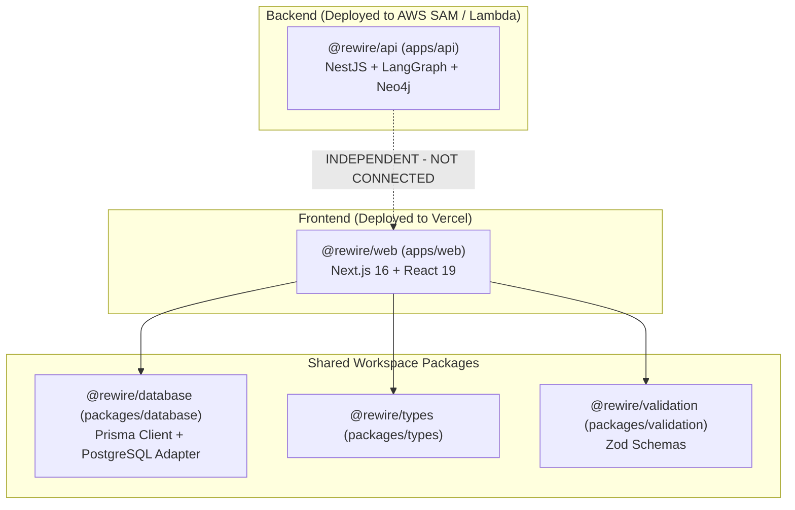
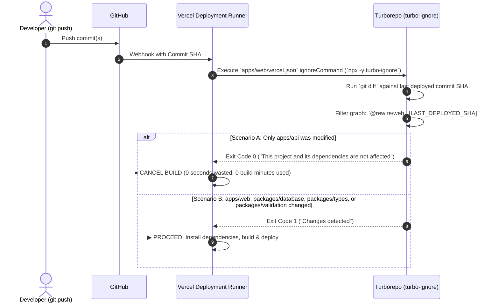
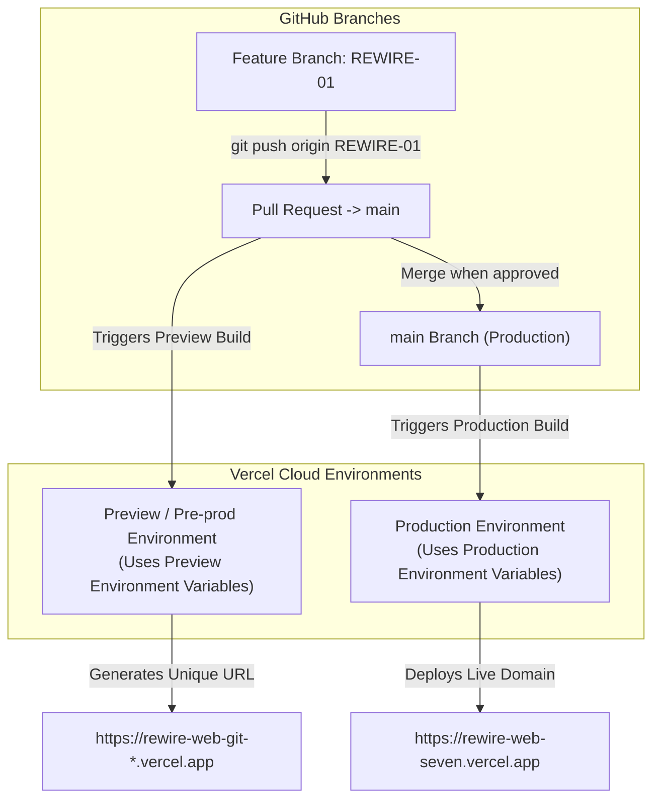

# Vercel CI/CD Deployment & Turborepo Optimization Guide

## 1. Executive Summary

This guide documents the production and pre-production (preview) deployment architecture for the **Rewire** monorepo frontend (`@rewire/web`) on **Vercel**, including:
- **Git-driven Continuous Deployment** (PRs -> Preview, `main` -> Production).
- **Turborepo Ignored Build Step (`turbo-ignore`)** to skip builds when only backend (`apps/api`) code changes.
- **Root Directory & Workspace Build Orchestration** (`cd ../.. && pnpm --filter @rewire/web... build`).
- **Upload Optimization** (`.vercelignore` reducing package size from 1.7 GB to ~722 KB).
- **Automated Environment Variable Management** via `scripts/vercel-env-sync.mjs`.

---

## 2. Monorepo Architecture & Dependency Graph

The Rewire codebase is structured as a pnpm monorepo managed by Turborepo:



### Key Architectural Insight
`@rewire/web` depends on `@rewire/database`, `@rewire/types`, and `@rewire/validation`. However, **`apps/api` is completely independent from `@rewire/web`**. Changes to the NestJS API or AWS SAM templates must **never** trigger a Vercel rebuild for the Next.js app.

---

## 3. How `turbo-ignore` Works Behind the Scenes

Vercel provides an **Ignored Build Step** lifecycle hook that runs before any dependency installation (`pnpm install`) or compilation occurs.

### Sequence Flow



### The Exit Code Protocol

Vercel adheres to an exact UNIX exit code convention for custom ignore commands:

| Exit Code | Meaning to Vercel | Vercel Action |
|---|---|---|
| **`0`** | No relevant changes detected | **Skips the build immediately.** No build minutes are consumed, no container initialized. |
| **`1`** | Relevant changes were detected | **Continues the build.** Installs packages, runs the build command, and deploys. |

### How Turborepo Determines "Affected" Workspaces

When `npx -y turbo-ignore` runs inside `apps/web`, it internally executes:
```bash
npx -y turbo@latest run build --filter="@rewire/web...[LAST_DEPLOYED_SHA]" --dry=json
```

- **The filter `@rewire/web...`** instructs Turbo:
  > *"Inspect `@rewire/web` AND all packages in its dependency tree (`@rewire/database`, `@rewire/types`, `@rewire/validation`)."*
- If git diff contains changes to:
  - `apps/web/**/*` -> **Exit 1** (Build)
  - `packages/database/**/*` -> **Exit 1** (Build)
  - `packages/types/**/*` -> **Exit 1** (Build)
  - `packages/validation/**/*` -> **Exit 1** (Build)
  - `pnpm-lock.yaml`, `turbo.json` -> **Exit 1** (Build)
  - `apps/api/**/*` -> **Exit 0** (Skip build!)

---

## 4. Git-Driven Continuous Deployment Strategy

Your GitHub repository (`aadarshbabu/rewire`) is connected directly to Vercel (`rewire-web`):



### Daily Workflow

1. **Develop on a Feature Branch**:
   ```bash
   git checkout -b my-feature
   # Make code changes...
   git commit -m "feat: updated mental health insights widget"
   git push origin my-feature
   ```
2. **Review on Pre-Prod (Preview)**:
   - Vercel automatically deploys a preview version with a unique URL.
   - Vercel posts the preview link directly in your GitHub Pull Request comments.
   - Preview uses the **Preview** environment variables.
3. **Merge to Production**:
   - Merge the PR into `main` on GitHub (or merge locally and `git push origin main`).
   - Vercel automatically deploys to **Production** with your **Production** environment variables.

---

## 5. Vercel Configuration Reference

### Project Settings on Vercel

| Setting | Value | Why It Is Configured This Way |
|---|---|---|
| **Root Directory** | `apps/web` | Allows Vercel to detect Next.js in `apps/web/package.json` while retaining access to monorepo root. |
| **Framework Preset** | `Next.js` | Enables automatic Next.js routing, SSR, ISR, and API route optimization. |
| **Build Command** | `cd ../.. && pnpm --filter @rewire/web... build` | Navigates to monorepo root so Turborepo builds Prisma client and packages in topological order before building Next.js. |
| **Output Directory** | `.next` | Standard Next.js build output within `apps/web`. |
| **Node.js Version** | `22.x` | Aligns with local development and monorepo runtime. |

### Configuration Files

#### 1. `apps/web/vercel.json` (Ignored Build Step)
```json
{
  "$schema": "https://openapi.vercel.sh/vercel.json",
  "ignoreCommand": "if [ \"$VERCEL_GIT_COMMIT_REF\" != \"preview\" ] && [ \"$VERCEL_GIT_COMMIT_REF\" != \"main\" ]; then exit 0; else npx -y turbo-ignore; fi"
}
```

#### 2. `.vercelignore` (Upload Optimization)
Excludes local caches, backend code, and temporary files before uploading to Vercel:
```
# Cache and build outputs
.turbo
.next
dist
build
out

# Backend API (deployed to AWS SAM / Lambda, not Vercel)
apps/api

# Dependencies
node_modules
.pnpm-store

# Secrets & local DBs
.env*
!.env.example
creds
*.db

# IDE & metadata
.agents
.vscode
.idea
artifacts
*.tsbuildinfo
*.log
.DS_Store
```
**Impact**: Reduced CLI upload bundle from **1.7 GB (442 files)** down to **~722 KB (81 files)**.

---

## 6. Environment Variable Automation

All secrets are kept out of source control and synchronized directly via CLI:

```bash
# Push apps/web/.env.production to Vercel Production
pnpm vercel:env:push:prod

# Push to Vercel Preview (reads apps/web/.env.preview or falls back to .env.production)
pnpm vercel:env:push:preview

# List all variables currently on Vercel
pnpm vercel:env:ls

# Pull variables down from Vercel to local environment files
pnpm vercel:env:pull:prod
pnpm vercel:env:pull:preview
```

### Synced Variables
- `BETTER_AUTH_SECRET`: Secret key for session encryption.
- `BETTER_AUTH_URL`: Canonical auth endpoint URL.
- `NEXT_PUBLIC_APP_URL`: Public web application URL.
- `DATABASE_URL`: Aiven PostgreSQL connection string (SSL mode required).
- `AWS_SQS_QUEUE_URL`: Amazon SQS FIFO/Standard queue URL for AI worker offloading.
- `AWS_REGION`: AWS region (`ap-south-1`).
- `REDIS_URL`: Aiven Valkey/Redis cache & session store connection string.

---

## 7. Command Cheat Sheet

| Command | Action |
|---|---|
| `pnpm vercel:deploy` | Manual instant pre-prod / preview deployment |
| `pnpm vercel:deploy:prod` | Manual instant production deployment |
| `pnpm vercel:env:push:prod` | Sync local `.env.production` -> Vercel Production |
| `pnpm vercel:env:push:preview` | Sync local `.env.production` -> Vercel Preview |
| `pnpm vercel:env:ls` | Display all configured variables on Vercel |
| `pnpm vercel:env:pull:prod` | Pull Vercel Production env -> `apps/web/.env.production.local` |
| `pnpm vercel:env:pull:preview` | Pull Vercel Preview env -> `apps/web/.env.preview.local` |
| `vercel project inspect rewire-web` | Inspect current Vercel Cloud project settings |
| `git push origin <branch>` | Automated Git-triggered Preview deployment |
| `git push origin main` | Automated Git-triggered Production deployment |

---

## 8. Better Auth Trusted Origins & Custom Domain Configuration

### 8.1 Why `trustedOrigins` Matters in Better Auth

Better Auth implements built-in **CSRF Protection** and **Origin Header Validation**. When a user signs in or registers (`/api/auth/sign-in/email`, `/api/auth/sign-up/email`), Better Auth verifies the incoming HTTP `Origin` header against:
1. `auth.options.baseURL` (or the `BETTER_AUTH_URL` environment variable).
2. The `trustedOrigins` array.

If the incoming request domain is not in this whitelist, Better Auth immediately returns **`403 Forbidden`** with an **`INVALID_ORIGIN`** error code.

### 8.2 Dynamic Resolution for Vercel Preview & Production

Because Vercel Preview deployments use dynamic URLs (e.g. `rewire-web-git-preview-*.vercel.app`), [apps/web/lib/auth.ts](file:///Volumes/CobletSSD/ProjectsSourceCode/rewire/apps/web/lib/auth.ts) is configured to dynamically resolve `baseURL` and whitelist all relevant origins:

```ts
const getBaseURL = () => {
  // Production custom domain configured via BETTER_AUTH_URL
  if (process.env.VERCEL_ENV === "production" && process.env.BETTER_AUTH_URL && !process.env.BETTER_AUTH_URL.includes("localhost")) {
    return process.env.BETTER_AUTH_URL;
  }
  // Vercel Preview & auto-generated URLs
  if (process.env.VERCEL_URL) {
    return `https://${process.env.VERCEL_URL}`;
  }
  return process.env.BETTER_AUTH_URL || "http://localhost:3000";
};

export const auth = betterAuth({
  baseURL: getBaseURL(),
  database: prismaAdapter(db, {
    provider: "postgresql",
  }),
  emailAndPassword: {
    enabled: true,
    minPasswordLength: 8,
    autoSignIn: true,
  },
  trustedOrigins: [
    "http://localhost:3000",
    "https://*.vercel.app",
    ...(process.env.VERCEL_URL ? [`https://${process.env.VERCEL_URL}`] : []),
    ...(process.env.BETTER_AUTH_URL ? [process.env.BETTER_AUTH_URL] : []),
    ...(process.env.NEXT_PUBLIC_APP_URL ? [process.env.NEXT_PUBLIC_APP_URL] : []),
    ...(process.env.BETTER_AUTH_TRUSTED_ORIGINS
      ? process.env.BETTER_AUTH_TRUSTED_ORIGINS.split(",").map((o) => o.trim())
      : []),
  ],
});
```

### 8.3 How to Add a Custom Domain in the Future

When you attach your own custom domain (for example, `https://rewire.app` or `https://preview.rewire.app`):

#### Method A: Via Environment Variables (Zero Code Changes - Recommended)
1. In Vercel Project Settings > **Environment Variables**:
   - Update `BETTER_AUTH_URL` for Production to your custom domain:
     ```env
     BETTER_AUTH_URL=https://rewire.app
     NEXT_PUBLIC_APP_URL=https://rewire.app
     ```
   - If using multiple domains or subdomains (e.g., `app.rewire.app`, `preview.rewire.app`), set:
     ```env
     BETTER_AUTH_TRUSTED_ORIGINS=https://rewire.app,https://www.rewire.app,https://preview.rewire.app
     ```
2. Redeploy or trigger a Git push for the new environment variables to take effect.

#### Method B: In Code via Wildcard ([apps/web/lib/auth.ts](file:///Volumes/CobletSSD/ProjectsSourceCode/rewire/apps/web/lib/auth.ts))
You can add your root domain and all its subdomains directly to `trustedOrigins` using wildcards:
```ts
trustedOrigins: [
  "http://localhost:3000",
  "https://*.vercel.app",
  "https://*.rewire.app", // Trusts all subdomains (preview.rewire.app, app.rewire.app, etc.)
  "https://rewire.app",   // Root apex domain
  // ...
]
```

### 8.4 Critical Rules to Avoid "Invalid Origin"
1. **Always Include Protocol**: Use `https://yourdomain.com`, **NOT** `yourdomain.com`.
2. **No Trailing Slashes**: Use `https://yourdomain.com`, **NOT** `https://yourdomain.com/`.
3. **Include Both Apex and Subdomain**: If you allow `www.rewire.app` and `rewire.app`, add both or use `https://*.rewire.app`.
4. **Vercel Preview Branch Aliases**: If you assign a fixed Vercel domain to your `preview` branch (e.g. `preview.rewire.app`), ensure it is added to `BETTER_AUTH_TRUSTED_ORIGINS` or `trustedOrigins`.

